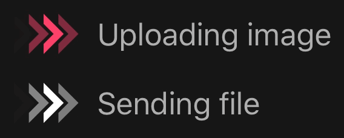
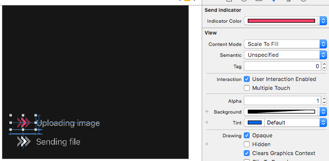

## SendIndicator



[](https://github.com/LeonardoCardoso/SendIndicator#requirements-and-details)
[](https://github.com/LeonardoCardoso/SendIndicator#cocoapods)
[](https://github.com/LeonardoCardoso/SendIndicator#carthage)

> Yet another task indicator

- [Requirements](#requirements)
- [Installation](#installation)
- [Usage](#usage)
- [License](#license)

## Requirements

- iOS 8.0+
- Swift 3.0+
- Xcode 8.0+

## Installation

### CocoaPods

[CocoaPods](http://cocoapods.org) is a dependency manager for Cocoa projects. You can install it with the following command:

```bash
$ gem install cocoapods
```

> CocoaPods 1.1.0+ is required to build SendIndicator 0.0.2+.

To integrate SendIndicator into your Xcode project using CocoaPods, specify it in your `Podfile`:

```ruby
source 'https://github.com/CocoaPods/Specs.git'
platform :ios, '8.0'
use_frameworks!

pod 'SendIndicator', '~> 0.0.2'
```

Then, run the following command:

```bash
$ pod install
```

### Carthage

[Carthage](https://github.com/Carthage/Carthage) is a decentralized dependency manager that automates the process of adding frameworks to your Cocoa application.

You can install Carthage with [Homebrew](http://brew.sh/) using the following command:

```bash
$ brew update
$ brew install carthage
```

To integrate SendIndicator into your Xcode project using Carthage, specify it in your `Cartfile`:

```ogdl
github "LeonardoCardoso/SendIndicator" ~> 0.0.2
```

### Manually

If you prefer not to use either of the aforementioned dependency managers, you can integrate SendIndicator into your project manually.

## Usage

You can use a `SendIndicator` on [Storyboards](#storyboard) or, if you want to do it programatically, you can create it just like you create a UIView:

```swift
let indicator = SendIndicator(frame: CGRect(x: 0, y: 0, width: 60, height: 35), palette: Palette(indicatorColor: .red)) // Choose a ration 12/7 for width/height
self.parentView.addSubview(downloadButton)
```
```swift
indicator.startAnimation()
```
```swift
indicator.stopAnimation()
``` 

### Storyboard

Last but not least, you can customize `SendIndicator` properties right from Interface Builder or Storyboards. 



## License

SendIndicator is released under the MIT license. See [LICENSE](https://github.com/LeonardoCardoso/SendIndicator/blob/master/LICENSE) for details.

### Follow me for the latest updates
<a href="https://goo.gl/UC8B8o"></a>
